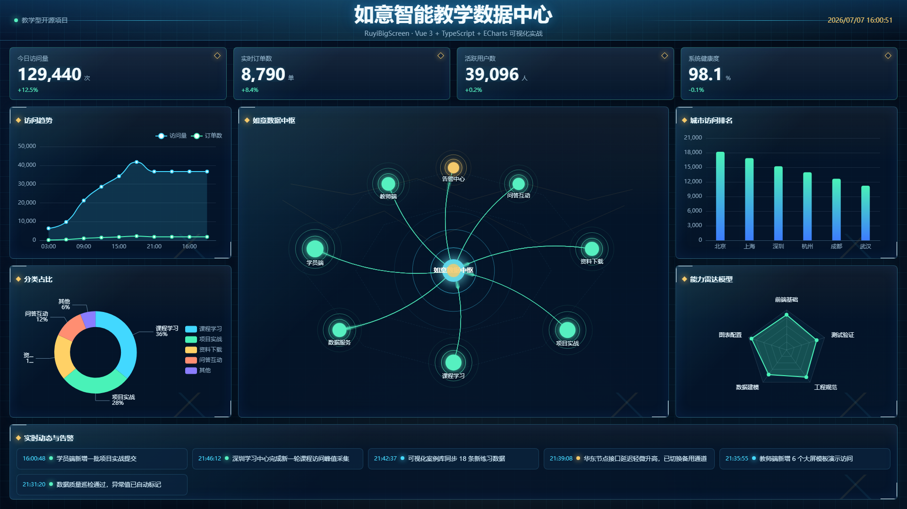

# RuyiBigScreen｜如意数据大屏

RuyiBigScreen 是一个教学型数据可视化大屏项目，用 Vue 3、TypeScript 和 ECharts 演示一个完整前端大屏从页面布局、mock 数据、状态管理到自动化验证的基本工程结构。

## 项目预览



## 项目简介

本项目面向前端初学者、数据可视化学习者和 AI 辅助编程课堂案例。它当前保持纯前端实现，默认使用 mock 数据模拟教学数据中心的运行状态，适合用来学习数据大屏的页面拆分、图表封装、数据服务分层和工程化验证流程。

项目不是已经接入真实后端的生产系统，而是一个可继续扩展的教学样例：现在可以通过本地 mock 运行，后续可以平滑切换到 API 数据源。

## 核心特性

- 16:9 风格的数据大屏布局，适合课堂演示和项目截图。
- Vue 3 + TypeScript 组织页面、组件、图表和服务层。
- ECharts 封装访问趋势、分类占比、城市排名、雷达模型和如意数据中枢。
- Pinia 管理 dashboard 数据加载、实时刷新和定时器清理。
- mock 模式下模拟指标、趋势、动态消息和业务节点的实时变化。
- Axios API 通道已预留，可通过环境变量切换数据源。
- Vitest 覆盖工具函数和 dashboard service 基础行为。
- Playwright 覆盖首页可见性、实时刷新和控制台错误检查。
- ESLint、Prettier、Stylelint 保持代码风格和质量约束。
- 自动化截图脚本生成 README 与课程资料可复用的展示图。

## 技术栈

- 前端框架：Vue 3、Vite、TypeScript
- 图表渲染：ECharts
- 状态管理：Pinia
- 数据访问：Axios、service 分层
- mock 支撑：MSW、本地实时数据模拟器
- 单元测试：Vitest、Vue Test Utils
- E2E 与截图：Playwright
- 代码质量：ESLint、Prettier、Stylelint

## 页面内容

- 顶部标题与当前时间：展示“如意智能教学数据中心”和实时钟表。
- 核心指标卡片：今日访问量、实时订单数、活跃用户数、系统健康度。
- 访问趋势：展示访问量和订单数的滑动趋势窗口。
- 分类占比：展示课程学习、项目实战、资料下载等分类占比。
- 如意数据中枢：用中心节点、业务节点和动态流线表示教学数据流转。
- 城市访问排名：展示不同城市访问量排序。
- 能力雷达模型：展示前端基础、图表配置、数据建模等学习能力维度。
- 实时动态与告警：展示教学数据中心的最新动态和轻量告警。

## 实时数据模拟

当前项目已经实现前端 mock 实时变化。页面进入时会立即加载一次数据，并每 2 秒刷新一次：

- 顶部指标会随业务规则变化。
- 访问趋势会追加新时间点，并保留有限长度。
- 实时动态会滚动生成新的教学场景消息。
- 如意数据中枢节点的活跃度和状态会小幅变化。
- 城市排名、分类占比和雷达数据会低频更新。

这些变化都来自本地 mock 模拟器，不代表真实后端数据。

## 项目结构

```text
src/
  app/              # 应用入口与全局样式
  charts/           # ECharts 图表组件
  components/       # 通用 UI 组件
  layouts/          # 大屏布局
  logs/             # 日志封装
  mocks/            # mock 数据与实时模拟器
  services/         # 数据访问与数据源切换
  stores/           # Pinia store
  tests/            # 单元测试与 E2E 测试
  types/            # TypeScript 类型
  utils/            # 工具函数
docs/
  screenshots/      # README 和课程资料使用的项目截图
scripts/
  capture-dashboard.mjs
```

## 快速开始

环境要求：

- Node.js 版本需满足当前依赖要求。
- 首次运行 Playwright 前，请确保本机已安装浏览器依赖。

安装依赖：

```bash
npm install
```

启动开发服务：

```bash
npm run dev -- --host 127.0.0.1 --port 10001
```

浏览器访问：

```text
http://127.0.0.1:10001/
```

## 常用命令

```bash
npm run dev
npm run build
npm run preview
npm run lint
npm run format
npm run test
npm run test:e2e
npm run screenshot
npm run screenshot:dashboard
```

## 数据源说明

项目默认使用 mock 数据源。mock 模式下，`dashboardService` 会调用本地实时模拟器生成下一帧 dashboard 数据，页面不会请求真实后端。

如果后续需要接入真实 API，可以设置：

```bash
VITE_DATA_SOURCE=api
```

在 API 模式下，服务层会通过 Axios 访问预留接口 `/dashboard`。当前仓库没有附带真实后端服务。

## 自动化截图

项目提供 Playwright 截图脚本，用于生成固定尺寸的大屏展示图。先启动开发服务：

```bash
npm run dev -- --host 127.0.0.1 --port 10001
```

再执行截图：

```bash
npm run screenshot
```

默认访问地址：

```text
http://127.0.0.1:10001/
```

默认输出文件：

```text
docs/screenshots/dashboard-1920x1080.png
```

截图视口为 `1920x1080`。脚本会等待标题、指标卡片和如意数据中枢渲染完成，并等待实时数据刷新一轮；如果浏览器 console 出现 error，截图会保留，但命令会失败并打印错误列表。

## 测试与质量保障

项目包含以下验证手段：

- TypeScript 构建检查。
- ESLint 检查 TypeScript 与 Vue 代码。
- Stylelint 检查样式。
- Vitest 单元测试。
- Playwright E2E 测试。
- Playwright 自动化截图。
- Vite 生产构建验证。

推荐在提交前运行：

```bash
npm run lint
npm run test
npm run build
npm run test:e2e
```

## 适合学习什么

- Vue 3 项目结构和组件拆分。
- 数据大屏 16:9 布局与响应式约束。
- ECharts 图表封装和 resize 处理。
- mock 数据、service 层和 API 切换设计。
- Pinia 状态管理与页面定时刷新。
- TypeScript 类型建模。
- Vitest 单元测试和 Playwright E2E 测试。
- 自动化截图在 README、课程资料和视觉验收中的用法。
- ESLint、Prettier、Stylelint 等前端工程规范。

## 后续计划

- 接入真实 API 示例。
- 增加更多教学场景图表组件。
- 增加主题切换能力。
- 增加视觉回归测试示例。
- 补充部署到静态站点平台的示例流程。

## License

本项目使用 MIT License，详见 [LICENSE](LICENSE)。
